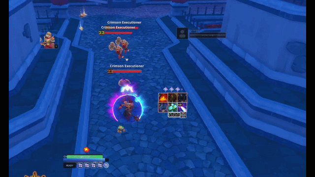
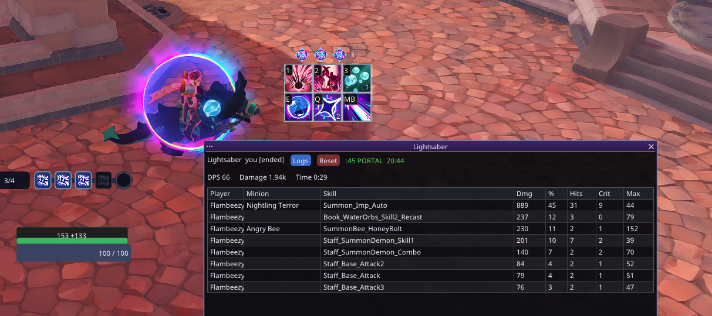

# SolarFlare — v1.4 Beta - Current Changelog -


## SolarFlare - v1.4b - Changelog

## What's new

* **Hide All Hotkey:** Toggle all SolarFlare HUD overlays on and off with a single bind (numpad by default, or middle mouse via Resource Tracker settings). F6 hub and builders remain unaffected.
* **Aura re-design featuring quick reference conditions that start a new aura build
* **Auras now have an optional glow effect
* **Auras now have countdowns/ups with quick reference button from cdb suggestion
* **Isolated Input Handling:** Keystrokes typed into any SolarFlare text field (aura names, search boxes, ID entry) no longer leak into Farever or trigger keybinds. Handled at the window-message level for absolute reliability.
* **Alt Key Isolation:** Alt no longer toggles look-lock while typing, preventing windows from closing out from under an open editor.
* **Geaux Ready Glow Mode:** Added a new "Ready glow" option on the Geaux grid featuring a bright core and sparks travelling the border, tinted from your existing Ready glow color.
* **Interactive CastleDB Spans:** The CastleDB span suggestion ("Listed: Xs") is now always a clickable button that switches the aura to a fixed span and applies the value.
* **Resource Tracker Refresh:** Page completely rebuilt with a compact navigation column, consolidated settings, and removed redundant per-row Lock and Transparent toggles.

## Fixes

* **Window Bounds:** HUD windows no longer walk off-screen when the game reclaims the cursor mid-drag.
* **Stuck Keys:** Held keys can no longer stick when a text field takes focus mid-keypress.
* **HudChrome Scaling:** Panels no longer clip or distort their contents at arbitrary sizes.
* **Optimized HUD Path:** Reduced per-frame overhead by resolving hotkey codes once, eliminating per-frame toast sizing queries, and stripping out menu-detection polling latency.
* **ImGui Plugin Independence:** SolarFlare now ships its own `sfimgui.hdll` plugin instead of relying on the shared `imgui64.hdll`, safely eliminating load-order conflicts with other mods.

## Install notes

* **Place `sfimgui.hdll` in `hlx/plugins/imgui/`, alongside its `fonts/` folder.
* **SolarFlare no longer requires `imgui64.hdll`. If another mod installs one, leave it—the two coexist safely.

---

### SolarFlare - v1.3b - Changelog

## What's new

* **Timers and countdowns on aura windows.
* **GetRifty rift clock.
* **Glow around icon in aura (geaux coming soon).
* **Added a prominent, theme-aware Create New Aura panel. Choose from a type, then select a condition from the list or go freemode.
* **Added searchable data.cdb catalogs for skills and statuses.
* **Added boss selection and boss-specific ability suggestions to Quick Start.
* **Added an embedded quick-start catalog containing 14 bosses and their abilities.
* **Redesigned the Aura builder with better visibility between option sets, templates, and user-friendly additions.

---

### SolarFlare - v1.2b - Changelog

## Added

* **Minion Attribution System:** Summon damage now properly credits the parent hero via `ent.Foe.summonOwner` / `summonSourceSkill` (`CombatOwnership`). Fully covers summons including *Eternal Flower Heart* (`Trinket_Bee`), *Pocket Hive* (`GM_MassGrab_Passive` → `Summon_Bee`), and *Silhouette of Almar* (`Staff_SummonDemon_Skill2` → `Summon_Imp`).
* **Minion Reporting & Logging:** Added a sortable **Minion** (`minionName`) table column to the overlay and exposed the `minion` field in JSON exports.
* **Damage Observation & Hooks:** Added `noteInflict` on outgoing hits from `Unit.onInflictDamage` (handling bee/imp as self) to dedupe against receive-side hits, `DamageObservation` to suppress duplicate `Foe` → `Unit` `onReceiveDamage` events for identical payloads, and `maxDamageTakenRecent` windowed helper for aura evaluation.
* **Enemy Cast Feed:** Added `noteCast` tracking for engaged foes, routing `BaseSkill.doStop` events into `EnemyCastCache` (`aura/event.cast`).
* **Aura Templates & Signals:** Added a dedicated **Status on me** aura template and expanded the aura catalog (skills, statuses, fxset) for improved search and ranking.
* **Shared Overlay Renderers:** Introduced `ChaincastRenderer` and unified the `ConduitOverlay.drawSlotRow` path to ensure builder previews identically mirror live HUD elements.
* **Skill Charge HUD Elements:** Added support for Geaux skill charges on bar snaps, featuring an optional charge digit and lit/hide rules to display remaining charges during cooldown regen.
* **Skill Hygiene:** Added automated skill ID coercion and JSON sanitization (`coerceSkillId`) across settings load, save, and rotation edits.

## Changed

* **Damage Source & Ownership Resolution:** Rebuilt source resolution order (`sourceUnit` → `serverSource` → `source` → `ctx.owner` → skill owner) and expanded event capture to trigger whenever an attacker or victim is owned by the local hero.
* **Receive Hook Architecture:** Refactored receive hooks into a paired prefix/postfix model with a shared observation gate across `Hero`, `Unit`, and `Foe`.
* **Lightsaber Ingestion:** Parser now accepts parent-credited `ROLE_YOU` and `ROLE_PLAYER` lines, preserving the minion label.
* **Overlay & Editor Cleanup:** Added sortable Minion column and streamlined the editor contents draw path.
* **Aura Builder UX:** Reorganized the signal catalog into dedicated groups (e.g., explicit "on me" status labels, isolated Instant Cast group), added clearer subject picker tooltips, and removed `skill.specialReady` from the picker (legacy configurations remain supported).
* **Aura Lifecycle Observation:** Updated local hero status tracking to leverage lifecycle hooks (`init`, stacks, duration, remove, net mark) with dirty-wake sampling; `skill.instantReady` now queries `shouldPlayInstantly`, pre-warms only `*_Proc` IDs, and falls back to `getStatusCount(skillId_Proc)`.
* **Resource Tracker Previews:** Chaincast previews now share the live badge, icon rail, and stack visibility settings (`N/4` or `READY`). Conduit previews reliably respect configured pip shapes with inset skill icons rather than generic dark diamond placeholders.
* **Debug Tool Controls:** Decoupled panel visibility from capture state in Payload Probe and Resolution Ledger. Recording is strictly manual, session-only, and gated by `armed()` to prevent uncontrolled JSONL growth.

## Fixed

* Fixed minion damage credit where `Unit.onInflictDamage` previously dropped bee and imp hits by requiring `isLocalHero(self)`.
* Fixed missing projectile damage sources (e.g., honey-bolts) by properly falling back to `ctx.owner`.
* Fixed Chaincast skill labels displaying raw byte strings (e.g., `(bytes : ???, length : N)`) across the next-cast list, Add Skill menu, spend picker, and live hints.
* Fixed Conduit overlay lighting to ensure equipped Sparkmaster conduit slots render at full brightness based on equipped counts or active Power stacks.

---

## Technical & User Notes

* **Minion Attribution:** Attribution relies strictly on runtime `summonOwner`; there are no per-summon skill hooks. `get_networkPropSummonOwner` returns a network Int and is not used for combat crediting.
* **Pyroclasm Setup:** For free-cast windows, configure **Instant Cast** with subject `Staff_Craft_S1`, or **Status** targeting `Staff_Craft_S1_Proc`.
* **Buff/Debuff Tracking:** Use **Statuses → Buff/debuff on me** (`status.present`) paired with active status IDs for encounters (e.g., bombs, elite affixes).
* **Logging:** Restoring or opening the Resolution Ledger / Payload Probe panels no longer records automatically. Click **Start recording** when capturing session data.

---

### SolarFlare - v1.1b - Changelog

## Added

* **Searchable Catalogs:** Added searchable catalogs for 516 units, 955 skills, and a complete icon list, with thumbnails displayed where available.
* **Persistent Aura Counters:** Added profile-persistent Aura counters so your counters persist when logging in and out. You can reset them in the aura builder.
* **Always On Option:** Added a radio button to enable "Always On" for auras like unit kill counts.
* **Window Persistence:** Automatic window size and position saving for the F6 menu. You don't have to resize a tiny window each time you login.
* **Aura Window Controls:** Added quick options atop the aura builder for window hide/transparent/always on.
* **Visual Polish:** Added highlighted settings cog icons to the Resource Tracker. Removed the old vector suns everywhere. They were a proof of concept that stuck, same reason sliders were scuffed.

## Changed

* **F6 Menu Layout:** Reorganized menu structure; moved **Show/Hide** and **Lock** options higher up for quicker access.
* **Panel Navigation:** Replaced appearance dropdowns with dedicated button-selected panels.
* **Slider Formatting:** Fraction sliders now display and adjust using percentages.
* **Aura Preview Behavior:** Aura previews now default to a paused state upon opening.
* **UI Clean-up:** Simplified section headings, reduced visual clutter, and improved Resource Tracker spacing with centered previews.
* **Data Isolation:** Saved IDs now operate independently from live units. This means your counters will not lose their configurations because their unit id was lost in the ledger.

## Fixed

* Fixed Geaux texture scaling and size preview rendering. The sliders work now.
* Fixed Aura skill and unit name resolution, including support for unequipped skills.
* Resolved ImGui child-window clipping and preview boundary errors.

---
This mod uses the HLX Modding Framework by https://github.com/laymain found here: https://hlx-framework.github.io/  

SolarFlare is a customizable HUD addon for Farever, built around three main features: **ResourceTracker, Auras, and Geaux**. Keep resources, skill readiness, and visual alerts where you want them on screen.

**Press F6 to show or hide the SolarFlare control panel.** Individual HUD windows have their own visibility settings.

## ResourceTracker

Build your HUD with independently movable resource and combat windows:

| Tracker | What it shows |
|---|---|
| Health | Current and maximum health, plus shield information. |
| Rage | Rage level, with a maximum-resource alert. |
| Mana / Spark | Mana or Spark, according to your active class resource. |
| Prayers | Smite, Life, and Shield prayer readiness. |
| Combo Points | Rogue combo points, from 0 to 6. |
| Attack Combo | Weapon attack-chain progress and final-step feedback. |
| Chaincast | Chaincast stacks, readiness, and remaining time. |
| Conduits | Sparkmaster conduit slots and Power stacks, from 0 to 20. |
| Current Target | Target portrait, name, health, and optional boss/elite badges. |

Each window can be hidden, locked, resized, and made transparent. Appearance options vary by tracker, including bar styles, vertical layouts, and pip shapes. Preview empty, partial, full, and alert states while setting up your layout.

**Start here:** F6 → Resources → Open Resource Tracker Builder. Select a tracker, turn off Hide, and adjust its settings.

## Auras

Create visual alerts for information that matters to your build:

- Health, shield, and class-resource thresholds.
- Skill readiness, cooldowns, and resource affordability.
- Status presence, stack counts, and remaining duration.
- Prayers, Combo Points, Chaincast, Conduits, and attack combos.
- Target conditions, target health, rift state, and specific enemy kills.
- Boss/unit kill counters, skill use counters, etc.

Start from a template or create your own aura. Choose **When It Shows**, then customize **How It Looks**. Use previews and the test tools to check your setup. Import and export auras to share them; advanced users can also use custom expressions.

**Start here:** F6 → Auras → Enable aura system → Open Aura Builder. Enable each aura you want to display, then save.

## Geaux

Build a personal skill-monitoring grid with the icons you want to watch:

- Adjustable rows, columns, spacing, and quick layout presets.
- Searchable skill catalog and drag-and-drop slot arrangement in the builder.
- Cooldown countdowns and radial cooldown indicators.
- Optional keybind labels and group tags.
- Options to dim unavailable skills or hide icons during cooldowns.
- Undo/redo and JSON layout import/export.

**Start here:** F6 → Geaux → Show Geaux grid → Open Geaux Builder. Assign skills from the catalog and arrange your slots.
You can also use Aura to make alerts for single spells if you want.

The gameplay grid is display-only: clicking it does not cast skills. Assignments and slot editing happen in Geaux Builder.

## More features

- **Profiles:** Save, copy, and switch shared HUD setups covering resources, Geaux, Auras, and theme.
- **Themes:** Choose a theme or customize colors.
- **Notebook:** Create, search, copy, and delete in-game notes; pages auto-save.
- **Lightsaber:** Local combat-log DPS meter. Include automatic logging and in-game log viewer.
- **Combat Log:** View skill casts and combat events, with display filters and optional recording.
- **Layout controls:** Save or reset the workspace layout, plus an optional on-screen F6 menu button.
- **Diagnostics:** Optional performance monitor and debugging tools for troubleshooting.

## Install

With HLX installed, copy the release files into your game's `hlx/mods/solarflare/` folder:

```text
hlx/mods/solarflare/
├── solarflare.hl
└── assets/
    ├── cdb/
    │   └── supplied JSON files
    └── icons/
        └── supplied atlases, logos, and icon files
```

Just copy the HLX folder & libhl64.dll to your game folder and you're yet.
Keep the supplied asset folders intact. `atlas.png/json` contains skill and UI artwork; `atlas2.png/json` contains target portraits. Start Farever and press **F6**.

## Move and resize your HUD

Unlock the window in its settings and free your game cursor. Drag the sun icon to move the window; drag its corner to resize. Lock it again when finished. Use each feature's Show or Hide setting to choose which windows remain visible. Sun icon also collapses/hides windows on press.
You can make the window transparent and leave it unlocked to get the best looking setup, then lock the windows. 

## Beta

Some features might be buggy. Some design might not be consistent, like the combat log area. Overall the mod is very usable. Source files are provided if you want to improve this one or make your own.
