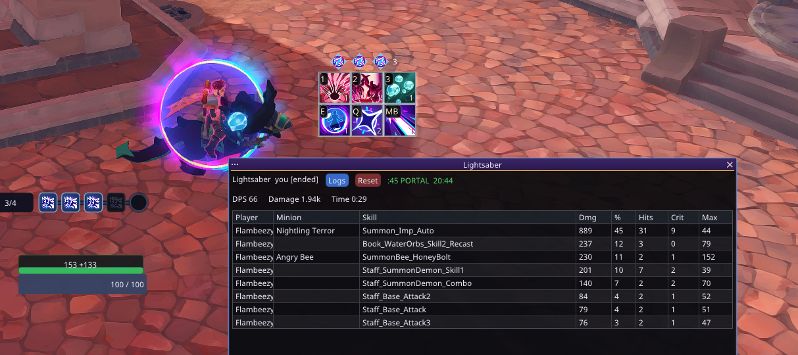

# SolarFlare — v3.0b (Beta)
> **The complete customizable HUD, Aura alert, and combat tracking suite for Farever.**



---

### Quick Controls

* **F6** — Show or hide the SolarFlare Control Hub & Builders.
* **Hide All Keybind** — Instantly toggle all SolarFlare HUD overlays on or off (Numpad by default, or Middle Mouse via Resource Tracker settings). The F6 hub remains accessible.
* **Move & Resize** — Unlock any window in its settings. Drag the **sun icon** to reposition; drag the bottom-right corner to resize; click the sun icon to collapse or hide. Re-lock when finished.

---

## Overview

**SolarFlare** is a fully customizable interface and combat awareness mod for **Farever**, built on the [HLX Modding Framework](https://hlx-framework.github.io/) by [laymain](https://github.com/laymain). It gives you complete control over your HUD with four flagship systems:

* **ResourceTracker** — Independent, movable widgets for Health, Shields, Rage, Mana/Spark, Prayers, Combo Points, Conduits, and Target Vitals.
* **Auras** — Dynamic visual alerts, procedural glow rings, countdown timers, and kill/use counters for buffs, procs, cooldowns, and boss mechanics.
* **Geaux Grid** — A dedicated, customizable skill-monitoring display featuring radial cooldown sweeps, charge indicators, and keybind labels.
* **Combat Intelligence** — In-game **Lightsaber** DPS meter (featuring full pet/minion attribution), live **Combat Log**, and the **GetRifty** timer.

---

## Six-Hook Runtime Release

SolarFlare's default runtime has been reduced from **44 hooks to only 6 event hooks**—an 86% reduction in installed hook targets. Continuous values such as health, shields, resources, cooldowns, statuses, stacks, durations, Combo Points, Chaincast, and Conduit state are now read through bounded sampling instead of competing hook paths.

The six remaining hooks are reserved for events that cannot be reconstructed reliably from current state:

1. Skill cast started
2. Skill cast stopped
3. Local skill use for prayer classification
4. Local incoming damage
5. Outgoing damage
6. SolarFlare UI drag start

This release was tested live with **Priest, Mage, Warrior, and Rogue**. Five combat captures recorded 1,834 ordered events with no hook installation failures, event-ring drops, SolarFlare exceptions, crashes, or missing behavior observed. Gameplay was noticeably smoother throughout the four-class test.

Diagnostic hooks are excluded from the normal `solarflare.hl` release and remain available only in the separate telemetry build.

---

## Installation (HLB v2–v6 Compatible)

> [!IMPORTANT]
> SolarFlare bundles its tested local HLX runtime build with support for HashLink bytecode versions **2, 3, 4, 5, and 6**. This includes Farever 0.2.4 / HLB v6 while retaining compatibility with older community mods. The bundled DLL exposes the HLX 0.0.10 API surface but is not claimed to be the byte-identical upstream release artifact.

1. Download **`SolarFlare_Live_v1.4b.zip`**.
2. Extract the contents directly into your **`Farever`** game root directory:

```text
Farever/
├── libhl64.dll                        <- Updated v6 + MinHook native loader
└── hlx/
    ├── config/
    │   └── loader.conf
    ├── loader/
    │   └── hlx-loader.hl              <- Synchronized loader bytecode (PBBDB_i ABI)
    ├── plugins/
    │   ├── sfimgui/
    │   │   ├── sfimgui.hdll           <- Isolated SolarFlare ImGui plugin
    │   │   └── fonts/                 <- Bundled UI fonts
    │   └── sfcursor/
    │       └── sfcursor.hdll          <- Lightweight Win32 cursor confinement plugin
    └── mods/
        └── solarflare/
            ├── solarflare.hl          <- Mod bytecode
            └── assets/                <- Supplied CDB tables, icons, and atlases
```


3. Launch **Farever** and press **F6**.

> [!NOTE]
> **Plugin Independence:** SolarFlare uses its own `sfimgui.hdll` rather than relying on a shared `imgui64.hdll`. If other installed mods require `imgui64.hdll`, you can leave it in place—both plugins coexist safely without load-order conflicts.

---

## Flagship Features

### 1. ResourceTracker
Build your ideal layout with independently movable, stylable resource and combat displays:

| Tracker | What it displays |
|---|---|
| **Health** | Current and max health, temporary shields, and dynamic alert thresholds. |
| **Rage** | Current rage levels with an optional maximum-resource pulse. |
| **Mana / Spark** | Automatically tracks Mana or Spark according to your active hero class. |
| **Prayers** | Readiness monitors for Smite, Life, and Shield prayers. |
| **Combo Points** | Rogue combo point tracking (0 to 6) with customized pip shapes. |
| **Attack Combo** | Real-time weapon attack-chain tracking with final-hit feedback. |
| **Chaincast** | Chaincast stack accumulation, readiness triggers, and remaining window timers. |
| **Conduits** | Sparkmaster conduit slot monitors and Power stacks (0 to 20). |
| **Current Target** | Target portrait, nameplate, health pool, and boss/elite difficulty badges. |

* **Customization:** Customize bar orientations (horizontal/vertical), borders, transparency, and pip shapes. Test empty, partial, full, and alert states in real time using the built-in previewers.
* **Getting Started:** Press **F6** → **Resources** → **Open Resource Tracker Builder**.

### 2. Auras
Create bespoke visual alerts for any gameplay condition:

* **Trigger Sources:** Health/shield/resource thresholds, skill cooldown readiness, resource affordability, status effects (buffs/debuffs on you or targets), prayers, combo stacks, rift states, and enemy casts.
* **Counters:** Persistent boss, enemy, and skill use counters that survive logout sessions.
* **Visual FX:** Procedural glow rings, custom icon styling, active timers (countdowns/countups), and sound/visual pulses.
* **Quick Start Catalog:** Searchable CastleDB database covering skills, statuses, and 14 bosses with pre-configured ability triggers.
* **Getting Started:** Press **F6** → **Auras** → Enable aura system → **Open Aura Builder**.

### 3. Geaux Skill Grid
A personal skill-monitoring grid designed to keep critical abilities in your field of view:

* **Layouts:** Configurable rows, columns, padding, and slot spacing presets.
* **Visual States:** Radial cooldown sweeps, text countdowns, charge count digits, ready-flashes, and dimmed unavailable states.
* **Ready Glow:** Border sparks and core pulses that highlight when priority abilities come off cooldown.
* **Getting Started:** Press **F6** → **Geaux** → Show Geaux grid → **Open Geaux Builder**. Assign abilities via the searchable skill catalog. *(Note: Geaux is an observation HUD; clicking slots does not cast skills).*

### 4. Combat Tracking & Utilities
* **Lightsaber DPS Meter:** Local combat log parser providing real-time damage-per-second tracking, breakdown tables, and minion damage attribution.
* **Pet & Minion Attribution:** Damage from summons (e.g. *Eternal Flower Heart* bees, *Pocket Hive*, and *Silhouette of Almar* imps) is credited to the parent hero.
* **GetRifty:** Integrated in-game rift clock and timer.
* **Notebook:** In-game scratchpad with full search, page duplication, and automatic persistence.
* **Profiles & Themes:** Save, duplicate, and switch whole-HUD profiles across characters; choose curated color schemes or define your own.

---
# Solar Flare v3.2b - New ExtraBars Builder

## ExtraBars builder
- Hold/Toggle takes priority: large mode choices for easier options navigation.
- Dedicated keybind area: enlarged current key display, prominent Record Key button, and separate Clear Key action.
- Improved readability: larger text, centered section headers, and plain rows replace the checkered styling.
- Separate layout controls: linked row/column sliders, presets, and previews are grouped under “Layout & look.”
- Added context menus
- Clear Item and Clear All buttons: remove item assignments while preserving keybinds. Clear All includes hidden cells; Undo restores assignments.
- Drag-and-drop assignments: drag catalog items onto cells without replacing their keybinds, or swap cells with their bindings.
- Cleaner Spark Cube display: removed the permanent outer gold frame.

## Aura builders — Quick Build and Advanced
- Clearer button styling: selected choices and final actions stand out; secondary actions use outlines, and independent options show checkbox indicators.
- Cleaner starting appearance: new auras default to icon presentation, with optional decorations and countdown displays left off.
- Show Icon control: hide an aura’s icon while keeping its text, counters, and tracking active.
- Independent Stacks and Counter: display both together, with separate placement and scale controls.
- Improved badge layout: timer, stack, and counter badges have spacing to prevent overlap. Advanced previews simulate each value independently.
- Counter reset no longer removes stacks information.
- Expanded timer choices: Quick Build offers Off, Count Down, and Count Up.
- Cooldown references: use game database values or available observed cooldown values to populate a fixed timer.
- Recorded cast-time references: cast timers prefer stable recorded durations, then database suggestions. Recorded ranks are selectable; Advanced retains manual timer overrides.
- Existing setups preserved: saved, copied, and imported auras retain their chosen presentation settings.
## Developer & Build Reference

### Build from Source
```powershell
haxe compile.hxml
```
* Generates `solarflare.hl`.

### Deployment
```powershell
.\deploy.ps1 -FareverRoot "C:\Path\To\Farever"
```

### Runtime Data Paths
| Kind | Path |
|---|---|
| Settings | `hlx/mods/SolarFlare/solarflare.json` |
| ImGui State | `hlx/mods/SolarFlare/imgui.ini` |
| In-game Notebook | `hlx/mods/SolarFlare/notebook.json` |
| Auras | `hlx/mods/SolarFlare/auras/` |
| CastleDB Assets | `hlx/mods/solarflare/assets/cdb/` |
| Icons & Atlases | `hlx/mods/solarflare/assets/icons/` |
| Lightsaber DPS Logs | `hlx/mods/SolarFlare/logs/saber/` |

---

## Feedback & Community

SolarFlare is in active Beta. While the core HUD, Auras, and Geaux systems are thoroughly tested, please report any unexpected behavior or layout quirks. Full source files and compile scripts are provided in this repository for modders and contributors.
