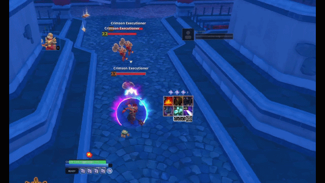
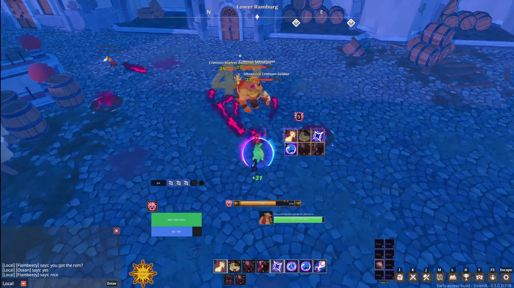
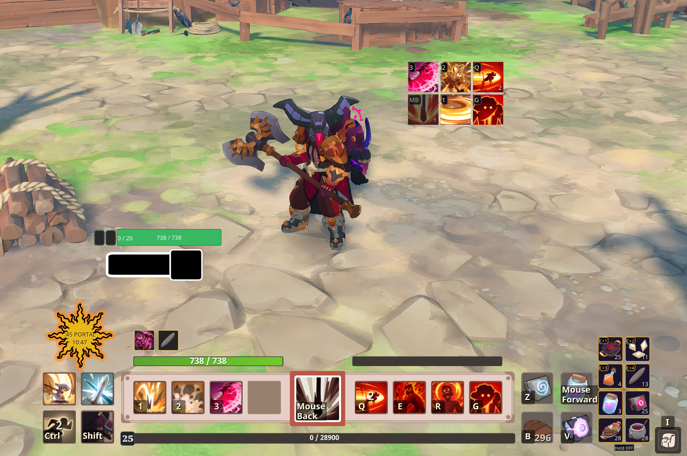
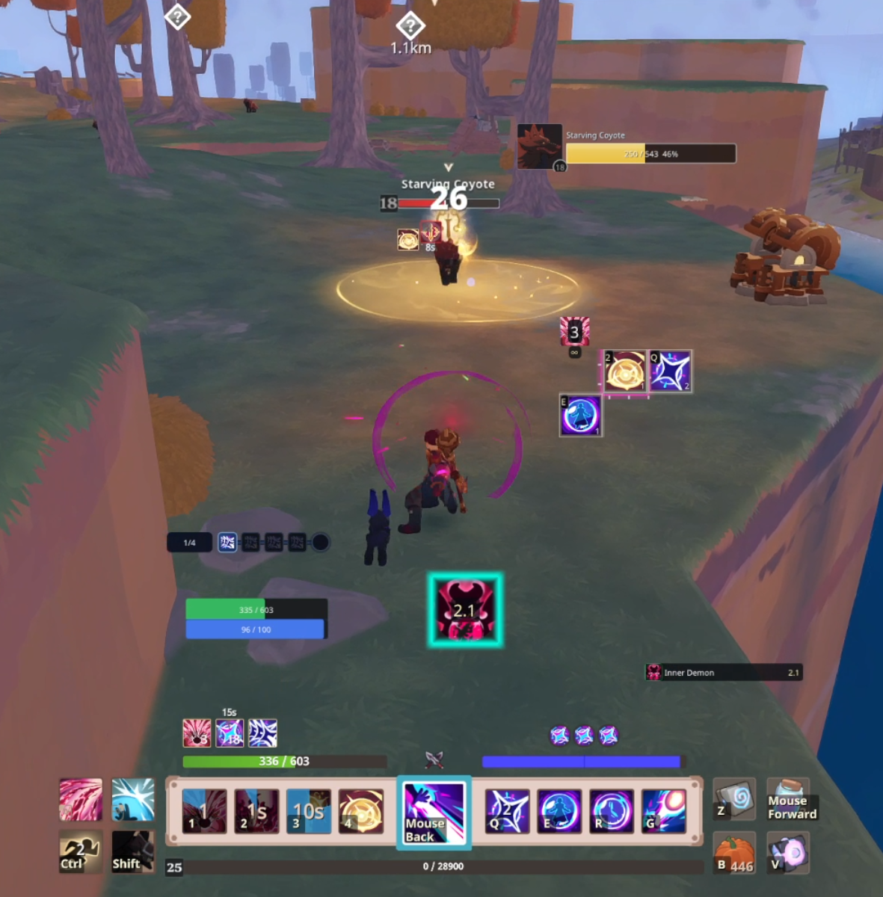

# SolarFlare — v3.4b (Beta)
> **The complete customizable HUD, Aura alert, and combat tracking suite for Farever.**



---

### Quick Controls

* **F6** — Show or hide the SolarFlare Control Hub & Builders.
* **Hide All Keybind** — Instantly toggle all SolarFlare HUD overlays on or off (Numpad by default, or Middle Mouse via Resource Tracker settings). The F6 hub remains accessible.
* **Move & Resize** — Unlock any window in its settings. Drag the **sun icon** to reposition; drag the bottom-right corner to resize; click the sun icon to collapse or hide. Re-lock when finished.
* **Collapse the hub** — Use **Collapse** in the hub to shrink it to a narrow module rail while you work in a builder. **Expand hub** brings it back.

---

## Overview

**SolarFlare** is a fully customizable interface and combat awareness mod for **Farever**, built on the [HLX Modding Framework](https://hlx-framework.github.io/) by [laymain](https://github.com/laymain). It gives you complete control over your HUD with these flagship systems:

* **ResourceTracker** — Independent, movable widgets for Health, Shields, Rage, Mana/Spark, Prayers, Combo Points, Conduits, and Target Vitals.
* **Auras** — Dynamic visual alerts, procedural glow rings, countdown timers, and kill/use counters for buffs, procs, cooldowns, and boss mechanics.
* **Geaux Grid** — A dedicated, customizable skill-monitoring display featuring radial cooldown sweeps, charge indicators, keybind labels, and proc glimmer.
* **BarTer** — Your own action bars for native skills, consumables, and display-only statuses, following the weapon you wear.
* **ExtraBars & Spark Cube** — Consumable bars with their own keybinds, plus a Spark Cube tracker.
* **Status Board** — A movable board of your active statuses.
* **Combat Intelligence** — In-game **Lightsaber** DPS meter (featuring full pet/minion attribution), live **Combat Log**, and the **GetRifty** timer.

---

## What's New in v3.4b

### A reorganized hub
* **Profile strip** — One compact line (`Profile  [selector]  Save  More`) shown on every hub page and in every builder. New, Copy, Delete, and "use this profile for this character" live in the **More** menu; a one-line chip tells you whether the profile auto-loads for your character. The large assign/reset button is gone.
* **Grouped navigation** — Modules are grouped into **Display**, **Automation**, and **Tools**, with a status dot on every module that has an on/off state.
* **Module cards** — Each hub page opens with a title, a one-line status, and a single **Open builder** button.
* **Collapse to rail** — Shrink the hub to a narrow rail that keeps the profile strip and module switching reachable.
* **GetRifty settings** are now a page in the hub instead of a separate window.
* **Consistent styling** — Selected items use one flat accent style; the glossy accent button is reserved for primary actions. All colors come from your active theme (Purple & Gold is just the default), and chrome-less transparent overlays are unchanged.
* **Calmer builders** — Collapsible groups in the Geaux and ExtraBars builders, bounded sliders, a header ladder with consistent spacing, and a card-based Aura Creation Home.

### Gameplay & HUD
* **BarTer follows your weapon** — Cells whose native action the worn weapon does not provide render empty (your layout is kept), and come back when you swap back.
* **Correct key labels** — BarTer shows the single key the engine has bound to each action (class skills included). No second binding, no modifiers.
* **Proc glimmer** — A soft sweep plays on BarTer and Geaux cells when a skill's instant proc turns on.
* **Attack Combo Tracker rewritten** — It now reads the engine's own attack chain and next-attack link instead of reconstructing steps from a counter, so steps, idle, and the finisher flash follow the real combo window.
* **Status Board** — Stable ordering with no flicker or duplicate rows; its context menu opens the hub's Status Board page; and statuses at the end of a busy list now fill in reliably after logging in or swapping characters.
* **BarTer consumables** — "In my inventory only" filter, matching ExtraBars.

### Under the hood
* Skill procs, stacks, and highlight flags are read from each skill's own script rather than the base implementation.
* Mana and Spark maxima are probed once and read through typed fields.
* Removed a large amount of dead code left over from the old hook-heavy runtime.

---

## Eight-Hook Runtime

SolarFlare's default runtime installs only **8 event hooks** (down from 44 in earlier releases). Continuous values such as health, shields, resources, cooldowns, statuses, stacks, durations, Combo Points, Chaincast, and Conduit state are read through bounded sampling instead of competing hook paths.

The remaining hooks are reserved for events that cannot be reconstructed reliably from current state:

1. Skill cast started
2. Skill cast stopped
3. Local skill use for prayer classification
4. Local incoming damage
5. Outgoing damage
6. SolarFlare UI drag start
7. Hud visibility update (keeps the native-UI hide setting applied)
8. Attack combo count change (wake-up for the Attack Combo Tracker)

The earlier six-hook release was tested live with **Priest, Mage, Warrior, and Rogue** across five combat captures with no hook installation failures, dropped events, SolarFlare exceptions, or crashes.

Diagnostic hooks are excluded from the normal `solarflare.hl` release and remain available only in the separate telemetry build.

---

## Installation (HLB v2–v6 Compatible)

> [!IMPORTANT]
> SolarFlare bundles its tested local HLX runtime build with support for HashLink bytecode versions **2, 3, 4, 5, and 6**. This includes Farever 0.2.4 / HLB v6 while retaining compatibility with older community mods. The bundled DLL exposes the HLX 0.0.10 API surface but is not claimed to be the byte-identical upstream release artifact.

1. Download the latest **SolarFlare Live** zip from the releases page.
2. Extract the contents directly into your **`Farever`** game root directory:

```text
Farever/
├── libhl64.dll                        <- Updated v6 + MinHook native loader
└── hlx/
    ├── config/
    │   └── loader.conf
    ├── loader/
    │   └── hlx-loader.hl              <- Synchronized loader bytecode (PBBDB_i ABI)
    ├── plugins/
    │   ├── sfimgui/
    │   │   ├── sfimgui.hdll           <- Isolated SolarFlare ImGui plugin
    │   │   └── fonts/                 <- Bundled UI fonts
    │   └── sfcursor/
    │       └── sfcursor.hdll          <- Lightweight Win32 cursor confinement plugin
    └── mods/
        └── solarflare/
            ├── solarflare.hl          <- Mod bytecode
            └── assets/                <- Supplied CDB tables, icons, and atlases
```

3. Launch **Farever** and press **F6**.

> [!NOTE]
> **Updating:** Replace `solarflare.hl` (and `sfcursor.hdll` if the release includes a new one). Your settings, profiles, auras, and notebook are kept.

> [!NOTE]
> **Plugin Independence:** SolarFlare uses its own `sfimgui.hdll` rather than relying on a shared `imgui64.hdll`. If other installed mods require `imgui64.hdll`, you can leave it in place—both plugins coexist safely without load-order conflicts.

---

## Flagship Features

### 1. ResourceTracker
Build your ideal layout with independently movable, stylable resource and combat displays:

| Tracker | What it displays |
|---|---|
| **Health** | Current and max health, temporary shields, and dynamic alert thresholds. |
| **Rage** | Current rage levels with an optional maximum-resource pulse. |
| **Mana / Spark** | Automatically tracks Mana or Spark according to your active hero class. |
| **Prayers** | Readiness monitors for Smite, Life, and Shield prayers. |
| **Combo Points** | Rogue combo point tracking (0 to 6) with customized pip shapes. |
| **Attack Combo** | Real-time weapon attack-chain tracking with final-hit feedback. |
| **Chaincast** | Chaincast stack accumulation, readiness triggers, and remaining window timers. |
| **Conduits** | Sparkmaster conduit slot monitors and Power stacks (0 to 20). |
| **Current Target** | Target portrait, nameplate, health pool, and boss/elite difficulty badges. |

* **Customization:** Customize bar orientations (horizontal/vertical), borders, transparency, and pip shapes. Test empty, partial, full, and alert states in real time using the built-in previewers.
* **Getting Started:** Press **F6** → **Resources** → **Open builder**.

### 2. Auras
Create bespoke visual alerts for any gameplay condition:

* **Trigger Sources:** Health/shield/resource thresholds, skill cooldown readiness, resource affordability, status effects (buffs/debuffs on you or targets), prayers, combo stacks, rift states, and enemy casts.
* **Counters:** Persistent boss, enemy, and skill use counters that survive logout sessions.
* **Visual FX:** Procedural glow rings, custom icon styling, active timers (countdowns/countups), and sound/visual pulses.
* **Quick Start Catalog:** Searchable CastleDB database covering skills, statuses, and 14 bosses with pre-configured ability triggers. Creation Home groups starting points into Utilities, Skills, Consumables, and Blank cards.
* **Getting Started:** Press **F6** → **Auras** → Enable aura system → **Open builder**.

### 3. Geaux Skill Grid
A personal skill-monitoring grid designed to keep critical abilities in your field of view:

* **Layouts:** Configurable rows, columns, padding, and slot spacing presets.
* **Visual States:** Radial cooldown sweeps, text countdowns, charge count digits, ready-flashes, proc glimmer, and dimmed unavailable states.
* **Ready Glow:** Border sparks and core pulses that highlight when priority abilities come off cooldown.
* **Getting Started:** Press **F6** → **Geaux** → Show → **Open builder**. Assign abilities via the searchable skill catalog. *(Geaux is an observation HUD; clicking slots does not cast skills.)*

### 4. BarTer
Your own bars of native skills, consumables, and statuses:

* **Native skills** show the key you bound in Options → Hotkeys; activation stays on the native binding.
* **Weapon-aware** — Layouts are remembered per weapon loadout, and cells for skills the worn weapon lacks stay empty.
* **Consumables** use the in-game consumable binding; filter the catalog to items in your inventory.
* **Statuses** can be placed as display-only cells.
* **Getting Started:** Press **F6** → **BarTer** → **Open BarTer editor**.

### 5. ExtraBars, Spark Cube, and Status Board
* **ExtraBars** — Consumable bars with per-cell keybinds, hold/toggle activation, and a drag-and-drop item catalog.
* **Spark Cube** — Charged/empty state, surge countdown, and burst damage readout.
* **Status Board** — Movable status strip with hide-this-status, icon size, columns, and optional seconds/stacks.

### 6. Combat Tracking & Utilities
* **Lightsaber DPS Meter:** Local combat log parser providing real-time damage-per-second tracking, breakdown tables, and minion damage attribution.
* **Pet & Minion Attribution:** Damage from summons (e.g. *Eternal Flower Heart* bees, *Pocket Hive*, and *Silhouette of Almar* imps) is credited to the parent hero.
* **GetRifty:** Integrated in-game rift clock and timer, configured from its hub page.
* **Notebook:** In-game scratchpad with full search, page duplication, and automatic persistence.
* **Profiles & Themes:** Save, duplicate, and switch whole-HUD profiles across characters; choose curated color schemes or define your own.

---

---

## Previous Release Notes

### v3.3b — Cooldown Resolution Corrections

- Updated CDB data: Switched to the verified current game database and regenerated all 11 canonical tables. Added source and output fingerprints plus a deployment check for stale or inconsistent data.
- Repaired status mappings: Restored omitted ability-to-status relationships, including timerless abilities and zero-duration statuses. Removed relationships targeting non-status skills and added authored stack limits.
- Fixed Nectar Balls configuration: Corrected the saved aura and profile copies to watch the six-second pickup buff. Kept the eight-pickup counter separate and removed the empty second condition.
- Unified status selection: Quick Build, wizard, manual selection, and saved rules now share status resolution. Explicit status IDs, unknown observed IDs, and selected display labels are preserved.
- Fixed reversed cooldown triggering: Cooldown countdowns now start when the skill enters cooldown. Becoming ready or affordable no longer starts a countdown.
- Repaired Game time: Ready and affordable conditions now retain live cooldown seconds, allowing their timers to follow the actual skill.
- Improved modifier accuracy: Live remaining seconds take precedence over CDB estimates. Removed incorrect fraction and millisecond guesses from native timer readings.
- Fixed stale skill observations: Enabled aura skill subjects are sampled independently of visible Geaux slots.
- Improved charge handling: Available charges remain usable while another charge refills. Proc timers such as Pyroclasm retain their separate behavior.
- Improved status timers: Active finite durations are rechecked for refreshes and extensions. Infinite statuses use explicit engine information; failed reads cannot repeatedly renew an estimate.
- Removed chat telemetry: Removed unused chat payload capture, storage, ledger entries, and recording prompts.
- Hardened hooks: Audited active hook declarations against current API signatures and isolated cast observer failures.
- Preserved rollback options: Previous implementations, bytecode, and settings were backed up. One timer implementation is active.

---

## Developer & Build Reference

### Build from Source
```powershell
haxe compile.hxml
```
* Generates `solarflare.hl`.

### Deployment
```powershell
.\deploy.ps1                     # compile, copy to .\build, install into Farever
.\deploy.ps1 -SkipBuild          # reuse the existing solarflare.hl
.\deploy.ps1 -ModDir "D:\...\Farever\hlx\mods\solarflare"
```
* The script prints `DEPLOYED` on success and `DEPLOY FAILED: <reason>` (then waits) on failure.
* Asset tables (CDB, icons, atlases) are copied by hand after a game patch.

### Runtime Data Paths
| Kind | Path |
|---|---|
| Settings | `hlx/mods/SolarFlare/solarflare.json` |
| ImGui State | `hlx/mods/SolarFlare/imgui.ini` |
| In-game Notebook | `hlx/mods/SolarFlare/notebook.json` |
| Auras | `hlx/mods/SolarFlare/auras/` |
| CastleDB Assets | `hlx/mods/solarflare/assets/cdb/` |
| Icons & Atlases | `hlx/mods/solarflare/assets/icons/` |
| Lightsaber DPS Logs | `hlx/mods/SolarFlare/logs/saber/` |

---

## Feedback & Community

SolarFlare is in active Beta. While the core HUD, Auras, and Geaux systems are thoroughly tested, please report any unexpected behavior or layout quirks. Full source files and compile scripts are provided in this repository for modders and contributors.
